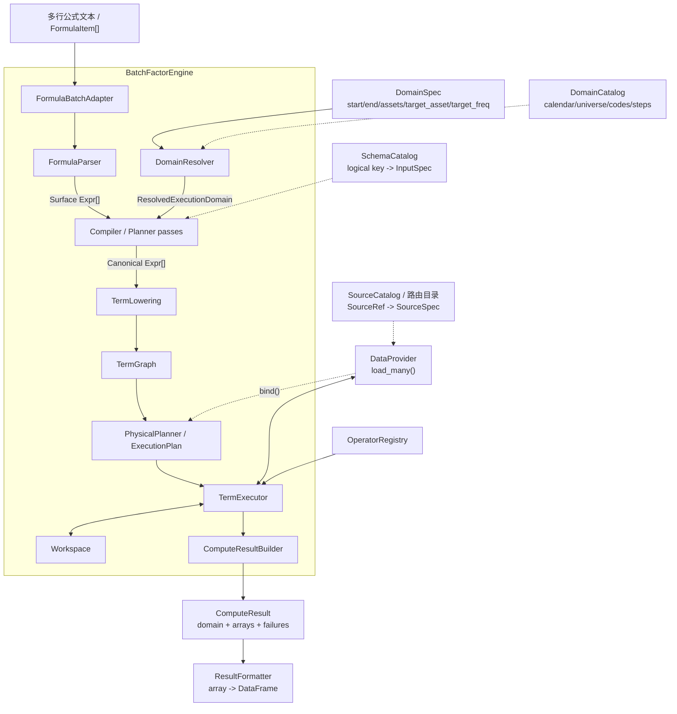
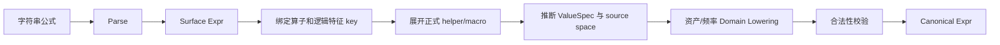
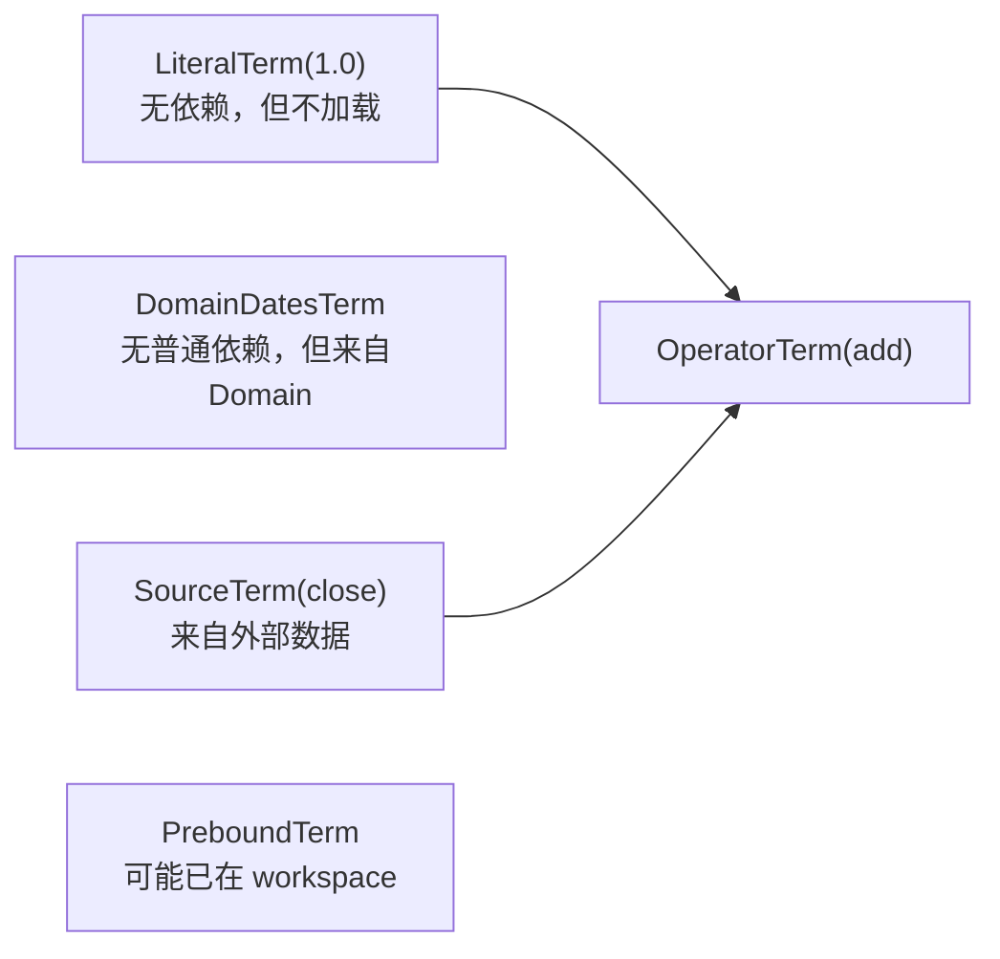
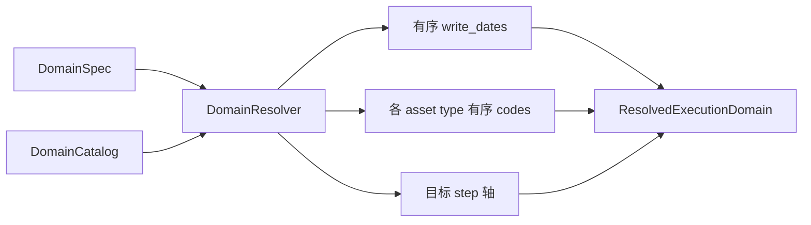
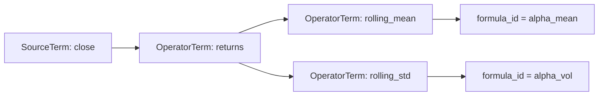
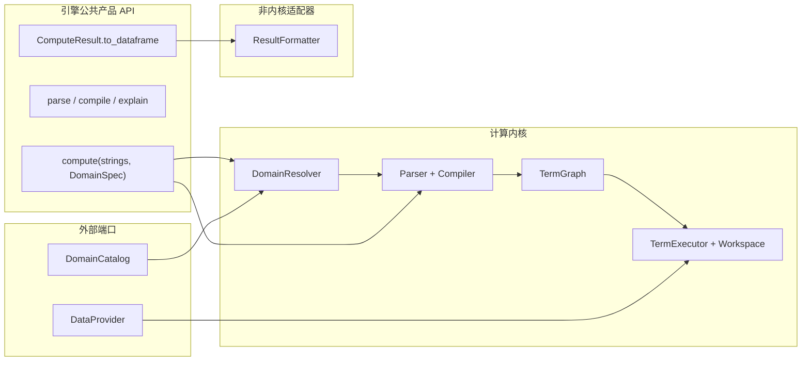

# 批量因子计算引擎架构设计

- 状态：草案
- 日期：2026-07-31
- 决策记录：[decisions.md](decisions.md)

## 1. 目标

本方案面向“一次提交多条字符串公式，返回目标因子数组”的主要场景，在现有
`FormulaParser -> Planner -> Executor -> DataRouter` 基础上，引入类似 Zipline
Pipeline 的 Term DAG、批量加载和 workspace 生命周期管理。

目标包括：

- 多条公式复用一套 Parser、资产/频率对齐和执行语义；
- 公式在执行前完全 Lower 为底层输入与算子；
- 数据路由与算子执行分离；
- 同一物理表的多个字段尽量一次读取；
- 使用 DAG 拓扑序执行，避免递归树求值的重复工作；
- 在最后一个消费者完成后及时释放中间数组；
- 结果数组拥有明确的日期、资产和 step 坐标；
- 保留未来增加日期分区、失败隔离、磁盘输出和多执行后端的边界。

第一版不以交互式 `FeatureDef` 生命周期、因子评价或长期物化协议为中心。这些能力可以
作为 Engine Facade 的上层适配器或后续结果组件接入。

## 2. 架构总览



推荐的公共入口是：

```python
result = engine.compute(
    formulas=[
        FormulaItem(id="alpha_1", expression="..."),
        FormulaItem(id="alpha_2", expression="..."),
    ],
    domain=DomainSpec(...),
    options=ExecutionOptions(...),
)
```

多行文本是 `FormulaBatchAdapter` 支持的便利输入；引擎内部统一使用结构化
`FormulaItem[]`，避免把行分隔、注释和 `formula_id` 规则带入 Compiler。

## 3. 分层

### 3.1 输入适配层

负责把多行文本、`dict[formula_id, formula]` 或 `FormulaItem[]` 规范化为统一批次。

```text
FormulaBatch
└── items
    ├── id
    └── expression: str | SurfaceExpr
```

这一层只处理输入协议，不访问数据，不解析 universe。

### 3.2 语义编译层

负责把字符串变成无隐式对齐语义的 Canonical Expr：



Compiler 结束后：

- alias 和 helper 已经展开；
- 每个叶子都有稳定逻辑 key 和输入规格；
- 股票到转债等唯一投影已经成为显式算子；
- 日频到日内的结构广播已经成为显式算子或明确的 singleton-step 语义；
- 多对一资产/频率转换已经由公式显式声明；
- delay、mask 和 PIT 政策不再由 Runtime 临时注入；
- Runtime 不需要读取 Store 来推断输出空间。

#### helper 与 SourceTerm

helper 是纯 Expr 构造器，不在解析过程中修改 DataRouter 或全局 source 注册表。
所谓“通过 helper 注册 SourceTerm”，是指 helper 返回的 Expr 显式包含
`SourceExpr`/`SourceRefExpr`，Compiler 在当前 FormulaBatch 内收集并 Lower 这些输入。

例如批任务版 `get_lf` 可以展开为：

```text
get_lf("ClosePrice", if_adj=True, if_sus=True)

    ↓ macro/helper expansion

apply_mask(
    multiply(
        source("stk.1d.ClosePrice"),
        source("stk.1d.adj_factor"),
    ),
    mask_not(source("stk.1d.IfSuspended")),
)
```

这会得到三个 SourceTerm，以及 `multiply`、`mask_not`、`apply_mask` 三个
OperatorTerm。DataRouter 数据字典负责把三个逻辑 source key 绑定到物理表和字段。

现有 Python 研究 helper 可以继续返回 FeatureDef，但它与字符串 DSL helper 应共享同一个
底层 Expr builder，避免复权和停牌规则出现两套实现。helper 扩展得到的是公式语义，
不是已经加载的数组。

如果继续兼容字符串中的裸 dotted key，需要把它明确定义为 `source(key)` 的语法糖，
或定义为另一种 materialized factor 引用；不能在 DAG 阶段再根据能否读取来猜测。

### 3.3 Term 计划层

TermLowering 把多个 Canonical Expr 一次性 Lower 为一个多输出 DAG。

最小 Term 模型为：

```text
Term
├── LiteralTerm
│   └── value
├── SourceTerm
│   ├── source_ref
│   ├── input_spec
│   └── source_domain
└── OperatorTerm
    ├── operator
    ├── input_term_ids
    └── normalized_params

所有 Term 共享
├── term_id
├── value_spec
├── domain_ref
├── lookback
└── semantic_key

ExecutionPlan.source_bindings
└── term_id -> SourceBinding
    ├── source_spec
    ├── read_domain
    └── load_group_key
```

顶层目标不需要单独的 `OutputTerm` 子类：

```text
outputs: formula_id -> term_id
```

同一个 Term 可以被多个公式命名为输出，也可以同时作为其他 Term 的输入。

LiteralTerm 只表示真正参与公式数据流的小型不可变字面量，例如 `add(x, 1.0)` 中的
`1.0`。`window=20`、`axis=0` 等算子配置属于 OperatorTerm 的 normalized params，
不形成 Term。大型用户数组通过 memory SourceTerm 或 initial workspace 提供。

#### OperatorSpec 最小协议

当前 OperatorSpec 只有 `name/func/output_asset/output_freq/output_step/preserves_shape`，
第一版不直接扩展为完整的算子描述语言。OperatorSpec 只承担运行前不可缺少的四件事：
定位函数、检查输入数量与 ValueKind、声明输出 ValueKind，以及计算日期回看。

```python
@dataclass(frozen=True)
class OperatorSpec:
    name: str
    func: Callable[..., ArrayValue]
    input_kinds: tuple[ValueKind, ...] | VariadicInput
    output_kind: ValueKind | SameAsInput
    date_lookback: int | LookbackInfer = 0
```

五个字段的职责如下：

| 字段 | Compiler/Runtime 用途 |
|---|---|
| `name` | DSL 绑定、诊断和 registry key |
| `func` | Runtime 实际调用的现有 `ops.py` 算子函数 |
| `input_kinds` | 只校验输入数量和每个输入的 ValueKind |
| `output_kind` | 声明固定输出 ValueKind，或沿用输入的 ValueKind |
| `date_lookback` | 静态推导有限 session lookback，默认 `0` |

`func` 就是当前实现中的算子函数，Runtime 契约保持为
`func(*input_arrays, **params) -> ndarray`，
不能访问 DataRouter、Workspace 或研究状态。确实需要 Domain 元数据的算子，应由 Compiler
把稳定、可序列化的元数据放入参数或显式输入，而不是让 kernel 查询全局对象。

`input_kinds` 不引入 InputContract 类层级。固定长度 tuple 同时表达输入数量和类型；
变长算子只增加一个很小的描述类型：

```python
VariadicInput(kind=ValueKind.MASK, min_count=1)
```

第一版只支持这里能表达的输入检查；复杂的输入间约束暂不进入 OperatorSpec。domain
是否合法以及输出 domain 是什么，全部由独立的 Domain Lowering 阶段决定：

- 普通算子先把所有携带 domain 的输入对齐，再令 OperatorTerm 继承这个公共 domain；
- LiteralTerm 不参与 domain 选择；仅由字面量组成的表达式保持无 domain；
- 显式投影、选择和重采样算子的目标 domain，由 AlignmentRule 在插入 OperatorTerm 时
  直接写入其 `domain_ref`。

因此 domain 是编译后 Term 的属性，不是底层数组函数的属性，OperatorSpec 不需要
`infer_domain`。

第一版不定义 `ParamSchema`。Parser 产生的字面量参数原样保存在 OperatorTerm 并传给
`func`；不统一校验参数类型和取值范围。Compiler 仅使用函数签名拒绝明显的未知参数或缺失
必填参数，并把 mapping key 排序、list 转 tuple 等通用规范化用于 Term 身份。对 CSE
无法稳定编码的大型或动态参数直接拒绝。影响取数范围的参数必须在编译期是字面量，并能被
`date_lookback` 读取，否则无法保证加载正确，应编译失败。

几个典型注册示例：

```python
OperatorSpec(
    name="add",
    func=add,
    input_kinds=(NUMERIC, NUMERIC),
    output_kind=NUMERIC,
)
```

```python
OperatorSpec(
    name="greater",
    func=greater,
    input_kinds=(NUMERIC, NUMERIC),
    output_kind=MASK,
)
```

```python
OperatorSpec(
    name="ts_mean",
    func=ts_mean,
    input_kinds=(NUMERIC,),
    output_kind=NUMERIC,
    date_lookback=lambda p: (
        int(p.get("window", 5)) - 1 if p.get("axis", 0) == 0 else 0
    ),
)
```

跨域算子仍使用同一协议。例如 AlignmentRule 在插入 `project_stk_to_cb` OperatorTerm
时，将转债输入轴对应的 domain 直接写为该 Term 的 `domain_ref`；`project_stk_to_cb`
的 OperatorSpec 只需描述输入/输出 ValueKind 和函数。

第一版 registry 只允许注册确定性、无副作用且不修改输入的数组函数。因此不需要为每个
OperatorSpec 重复保存 `pure=True`，所有 OperatorTerm 都可按结构执行 CSE。未来确实引入
随机、状态化或原地修改输入的算子时，再增加独立的执行 traits，而不是提前扩大第一版协议。

不建议把对齐矩阵重新编码成 `output_asset/output_freq/output_step` 字符串。边界是：

```text
AlignmentRuleRegistry
    判断 source domain -> target domain 是否有唯一投影
    ↓
插入明确的投影 OperatorTerm
    ↓
OperatorSpec
    校验并执行这个明确算子
```

第一版暂不放入 OperatorSpec：

- `semantic_version` 和持久化编译计划兼容性；
- 通用参数 schema、参数类型和取值范围验证；
- pure/stateful/mutates-input 等执行 traits；
- 缺失值质量统计；
- cost/memory estimator；
- fusion group；
- `out=`、buffer reuse 和 input mutation 描述；
- 多后端 kernel；
- profiling tags；
- 多输出算子。

这些字段在没有真实 workload 前加入只会扩大协议，且不影响第一版正确执行。

### 3.4 执行层

TermExecutor 接收不可变 ExecutionPlan，在一个任务或日期分区内维护可变 Workspace。
它只做：

- 遍历拓扑序；
- 请求外部输入；
- 调用底层算子；
- 校验输出 shape/ValueSpec；
- 更新引用计数并释放值；
- 收集目标输出和结构化失败。

它不做：

- 解析字符串；
- 推断资产或频率转换；
- 搜索 FeatureStore/DataRouter fallback；
- 修改 universe；
- 生成 DataFrame；
- 决定长期存储路径。

### 3.5 数据端口

DataProvider 负责把 SourceTerm 变成数组。建议的概念协议为：

```python
class DataProvider:
    def bind(
        self,
        terms: Sequence[SourceTerm],
        domain: ResolvedExecutionDomain,
    ) -> Mapping[TermId, SourceBinding]: ...

    def load_many(
        self,
        terms: Sequence[SourceBinding],
        request: LoadRequest,
    ) -> Mapping[TermId, ArrayValue]: ...
```

`bind()` 解析并验证来源，生成 SourceBinding，尽量在执行前暴露缺失字段和不兼容数据规格；
`load_many()` 执行真正的 SQL、Parquet、Store 或内存读取。

当前 `DataRouter.resolve_source()` 可迁移到 bind/SourceCatalog；
`read()`/`read_spec()` 可迁移到 `load_many()` 的单字段兼容路径。

#### 复用现有 DataRouter 数据字典

第一阶段不需要先拆出新的 SourceCatalog 服务。现有 DataRouter 可以同时实现：

```text
SourceCatalog capability
    data_dict
    search()
    resolve_source()

DataProvider capability
    bind()
    load_many()
```

`data_dict` 已经能按 asset、frequency、field 和 table 发现普通表字段，适合作为
SourceTerm 绑定的第一版目录。需要补充的是批量读取所需的稳定 dataset identity
和完整参数，而不是推翻这份数据字典。

当目录扫描、缓存生命周期和实际 I/O 需要独立扩展时，再把这两个 capability 拆成对象；
TermGraph 始终只依赖逻辑 InputSpec，Runtime 始终只依赖 DataProvider 协议。

#### SourceTerm、SourceSpec 与 SourceBinding

三者分别属于语义、基础设施和任务绑定：

```text
SourceExpr / SourceRef
    ↓ TermLowering
SourceTerm                         # 公式语义
    ↓ DataRouter.bind()
SourceBinding                      # 本次任务
    ├── SourceSpec                 # 物理来源
    ├── read_domain
    └── load_group_key
```

- SourceTerm 保存稳定逻辑 key、语义参数、InputSpec 和 source domain；
- SourceSpec 保存 provider、database/table/path、field 和 reader/query parameters；
- SourceBinding 把 SourceTerm、SourceSpec 与本次 read domain 关联起来，属于 ExecutionPlan。

SourceTerm 不应直接保存 table/path。否则同一公式在开发、回测和生产环境使用不同数据位置时，
TermGraph 和公式语义签名也会变化。当前 `SourceSpec` dataclass 可以继续用作第一版物理描述；
helper 则优先产生不带物理路径的 SourceRef。

## 4. 为什么 SourceTerm 不能由“无依赖”推断

DAG 的结构只表达“谁依赖谁”，不表达“值从哪里产生”。



因此推荐使用显式来源语义：

| 节点 | 判定依据 | 执行动作 |
|---|---|---|
| LiteralTerm | Expr 是字面量 | 直接使用 scalar/常量值 |
| SourceTerm | Expr 是逻辑输入或 helper 展开的 SourceExpr | 交给 DataProvider |
| OperatorTerm | Expr 是已注册底层算子 | 从 workspace 取依赖并计算 |
| Prebound value | term_id 已存在于 initial workspace | 跳过加载/计算 |

Compiler 负责声明“这是一个外部输入”；DataProvider 负责确认“我能绑定并加载它”。
这比 Runtime 尝试每个无依赖节点或执行 fallback 链更容易验证和诊断。

Zipline 同样把其 `LoadableTerm` 定义为显式类型。其引擎遍历执行序时，对
`isinstance(term, LoadableTerm)` 的节点调用 loader，而不是检查图入度；本项目把这一
角色命名为 SourceTerm。

## 5. Domain 模型

### 5.1 DomainSpec

外部请求使用简洁声明：

```python
DomainSpec(
    start="2025-01-01",
    end="2025-12-31",
    assets={
        "stk": UniverseRef("csi500_constituents"),
        "idx": CodeList(["000905.SH"]),
    },
    target_asset="stk",
    target_freq="1d",
)
```

`assets` 的外部语法可以支持字符串、列表和字典，但进入 Resolver 前应规范化为：

```text
AssetSelectionSpec
├── asset_type
└── selector
    ├── UniverseRef(name, version?)
    ├── CodeList(codes)
    └── CatalogQuery(query_id, params)
```

不建议让任意 callable 或 SQL 文本进入 DomainSpec，否则请求语义难以序列化、缓存和复现。

### 5.2 ResolvedExecutionDomain

推荐的解析结果为：

```text
ResolvedExecutionDomain
├── output_domain
│   ├── write_dates
│   ├── target_asset
│   ├── target_codes
│   ├── target_freq
│   └── target_steps
├── asset_axes
│   └── asset_type -> ordered codes
├── calendar_id/version
├── universe identities/versions
└── fingerprint
```

解析过程为：



如果 universe 每日变化，建议 ResolvedExecutionDomain 使用区间内 codes 的稳定并集作为固定轴，
每日成员关系通过 mask Term 表达。这样所有数组仍保持规则的 `T x N x S` shape。

### 5.3 TermDomain 与读取窗口

ResolvedExecutionDomain 描述任务输出坐标，不代表所有 Term 都在相同 source space。

例如转债目标公式引用股票日频收盘价：

```text
SourceTerm(stk.1d.close)
    source domain = stk x 1d
        ↓
OperatorTerm(project_stk_to_cb)
    output domain = cb x 1d
        ↓
OperatorTerm(...)
    target domain = cb x 1d
```

ExecutionPlan 根据每个 Term 的 lookback 计算读取窗口：

```text
write dates: 2025-01-10 .. 2025-01-31
rolling window: 20
read dates:  2024-12-12 .. 2025-01-31
```

DataProvider 只把叶子数据对齐到 SourceTerm 的 source domain。资产投影、频率投影和
因子运算由 OperatorTerm 完成。

### 5.4 第一版简化 lookback

第一版采用一个任务或日期分区级的统一 `lookback_sessions`，不实现 Zipline
逐 Term `extra_rows + offset`：

```text
term_lookback(term) =
    local_lookback(term.operator, literal_params)
    + max(term_lookback(dependency))

job_lookback =
    max(term_lookback(output_term))
```

`local_lookback` 由 OperatorSpec 声明：

| 算子类型 | 日期 lookback |
|---|---:|
| source、常量、逐元素、截面、同日资产投影 | 0 |
| `delay(periods=p, axis=date)` | p |
| `ts_mean/ts_std/... (window=w, axis=date)` | w - 1 |
| 日内 step delay/rolling | 0 |

例如：

```text
ts_mean(delay(source(close), periods=2), window=5)

lookback = 2 + (5 - 1) = 6 sessions
```

ExecutionPlan 在 DomainCatalog 的交易日历上向前扩展 `job_lookback` 个 session，
整张 DAG 在扩展后的日期轴上计算，最终输出统一裁掉前导日期，只返回 write dates。
所有输入使用相同 read dates 会多读少量数据，但能显著简化：

- LoadGroup 合并；
- Term 数组 shape；
- Workspace 管理；
- 输出裁剪；
- 日期 chunk 的 overlap。

当前实现的 `infer_date_overlap()` 已接近这个算法，但通过算子名集合硬编码规则。新设计
应把规则迁入 OperatorSpec，例如：

```python
OperatorSpec(
    name="ts_mean",
    func=ts_mean,
    date_lookback=lambda params: int(params["window"]) - 1,
)
```

影响 lookback 的参数第一版必须在编译期可知。动态 window 无法静态确定读取范围时直接
编译失败，而不是在 Runtime 中临时补读。

日期轴算子还必须声明有限 lookback。`ffill(limit=None)`、累计窗口等无界历史算子在
日期分区执行时应拒绝，或要求显式有限上限。DataProvider 为 as-of join、公告查询等
自行扩展底层查询范围属于 source 内部实现；只要返回值与 LoadRequest 的 read dates
对齐，就不进入 DAG lookback。

如果后续 profiling 表明统一窗口造成显著过量读取，第二阶段先优化为
“每个 LoadGroup 一个 lookback”，仍不必立即实现 Zipline 的逐 Term offset。

## 6. 加载计划

### 6.1 LoadGroup

TermGraph 完成后，ExecutionPlan 为 SourceTerm 建立 LoadGroup：

```text
LoadGroupKey
├── provider identity
├── physical dataset identity
├── source asset/frequency
├── read-domain identity
├── reader parameters
├── adjustment/version semantics
└── value encoding contract
```

同组 Term 只在字段名不同：

```text
table: market_daily
fields:
    stk.1d.open
    stk.1d.close
    stk.1d.volume
```

DataProvider 可以生成一次查询：

```sql
SELECT trade_date, inner_code, open, close, volume
FROM market_daily
WHERE trade_date BETWEEN ... AND ...
  AND inner_code IN (...)
```

然后一次完成日期/代码索引构造，拆成三个数组返回 workspace。

### 6.2 加载时机

推荐第一版采用“计划期分组、执行期首次访问整组加载”：

1. 编译结束时已知道所有 SourceTerm 和 LoadGroup；
2. 拓扑循环第一次遇到某组中尚未加载的 Term；
3. DataProvider 一次加载该组所有仍需要的字段；
4. `workspace.update(loaded)`；
5. 后续同组 Term 已存在于 workspace，直接跳过。

相比任务开始时全部预取，这种方式给后续按分区执行和失败隔离保留空间；相比单 Term
即时加载，它避免同表重复扫描。

## 7. Workspace 与执行算法

### 7.1 Workspace 状态

```text
Workspace
├── values: term_id -> value
├── remaining_consumers: term_id -> int
├── pinned_outputs: set[term_id]
├── loaded_groups: set[load_group_id]
└── metrics
```

初始引用数建议为：

```text
remaining_consumers(term) =
    DAG out-degree(term)
    + 1 if term is a requested output else 0
```

一个计算 Term 完成后，对它消费的每个 dependency 执行 `decref`。计数降为零时，从
workspace 删除该 dependency。

### 7.2 拓扑执行伪代码

```python
workspace = Workspace(plan.initial_refcounts())

for term in plan.execution_order:
    if workspace.contains(term.id):
        continue

    if isinstance(term, SourceTerm):
        group = plan.load_group_for(term.id)
        loaded = data_provider.load_many(
            plan.pending_terms(group, workspace),
            plan.load_request(group),
        )
        workspace.put_many(loaded)

    elif isinstance(term, LiteralTerm):
        workspace.put(term.id, term.value)

    elif isinstance(term, OperatorTerm):
        inputs = [workspace.get(dep) for dep in term.dependencies]
        value = operators[term.operator].compute(inputs, term.params)
        validate_value(term, value)
        workspace.put(term.id, value)

        for dependency in term.dependencies:
            workspace.decref_and_release(dependency)

outputs = {
    formula_id: workspace.take_output(term_id)
    for formula_id, term_id in plan.outputs.items()
}
```

实现时需要补充：

- SourceBinding 只保存在 ExecutionPlan，不进入 workspace，也不参与数组引用计数；
- 算子失败时依赖数组是否还能安全释放；
- 一个 Term 同时是输出和其他 Term 输入时的所有权；
- 数组 view、广播 view 和底层 storage 共享时的字节统计；
- 是否允许算子复用最后一个输入 buffer。

第一版可以先保证引用正确和不提前释放，再逐步加入 in-place/buffer reuse。

### 7.3 多公式输出



`returns` 只计算一次；`close` 在 `returns` 完成且没有其他消费者后即可释放；
`returns` 在 `rolling_mean` 和 `rolling_std` 都完成后释放。输出 Term 保留到结果收集。

完整 CSE 是否在第一版启用仍待决定，但 DAG 和引用计数协议不应阻碍它。

## 8. 结果模型

建议结果为：

```text
ComputeResult
├── domain: ResolvedExecutionDomain
├── arrays: formula_id -> ndarray[T, N, S]
├── failures: formula_id -> FormulaFailure
└── report
```

所有数组共享 `domain.output_domain`，避免为每个数组重复携带坐标。

### 8.1 DataFrame 适配

建议由独立 ResultFormatter 实现，`ComputeResult` 可提供委托方法：

```python
result.to_dataframe(
    formulas=["alpha_1", "alpha_2"],
    layout="long",
    drop_missing=False,
)
```

建议的 long layout：

```text
index:  date, code, step
columns: alpha_1, alpha_2, ...
```

当 `step` 只有一个值时可以省略 step 索引。是否同时支持每个公式一个宽表，需要根据
实际调用方确定。

转换必须显式，因为 `T x N x S` 数组转长表可能产生很大的索引和数据复制。

## 9. 已确认的引擎边界

已经确认如下：

| 能力 | 推荐归属 | 原因 |
|---|---|---|
| 字符串解析为 Expr | Engine 内部 Compiler 子系统；额外公开专家 API | 公式语言是计算语义的一部分，普通调用方不应重复编译流程 |
| DomainSpec 解析 | Engine Facade 编排 DomainResolver；DomainCatalog 外部注入 | Compiler 必须使用固定域，但日历和 universe 状态不应成为 Engine 隐藏状态 |
| Array 转 DataFrame | Engine 核心外的 ResultFormatter；`ComputeResult` 提供便捷委托 | 属于展示/互操作，可能产生巨大复制，不应污染 Runtime |

边界可概括为：



“在引擎产品内部”与“在 Runtime 内核内部”不是同一个边界。Parser、Resolver
编排和 ResultFormatter 可以由同一个 Python 包向用户提供，同时保持 Runtime 的窄职责。

## 10. 与当前实现的主要差异

| 主题 | 当前实现 | 新方案 |
|---|---|---|
| 请求粒度 | `Calculator.calculate()` 单公式 | FormulaBatch 多公式 |
| 编译结果 | Planner 返回 Expr 树 | Canonical Expr + Term DAG |
| 执行方式 | `Executor._eval()` 递归求值 | 拓扑循环 |
| 中间结果 | 只缓存叶子；Calculator 保留命名结果 | Workspace 管理全部 Term |
| 内存释放 | 生命周期通常覆盖一次 eval/Calculator | 按最后消费者及时释放 |
| 数据发现 | Executor 内 Store/Router fallback | 编译/绑定期显式 SourceTerm |
| 数据读取 | `read_spec()` 单字段 | `load_many()` 同数据集多字段 |
| 计算域 | FeatureStore snapshot/FeatureSpace 隐式提供 | DomainSpec -> ResolvedExecutionDomain |
| 日期分区 | FeatureManager 驱动 chunk 循环 | PhysicalPlan/执行层负责 |
| 结果 | 单个 CalculationResult | 多公式 ComputeResult |
| DataFrame | 调用方自行处理 | 显式 ResultFormatter |

## 11. 建议的实现切片

### Slice 1：Term DAG 与拓扑执行

- 保留现有 Parser；核心验证阶段只接受同域输入，不复用旧 Planner 的隐式跨域行为；
- 为规范化 Expr 建立稳定 TermLowering；
- 实现 LiteralTerm、SourceTerm 和 OperatorTerm；
- 实现拓扑排序、Workspace 和引用计数；
- 用现有 DataRouter 单字段读取作为临时 DataProvider；
- 建立与当前 Executor 的结果等价测试。

### Slice 2：批量输入和批量取数

- 增加 FormulaBatch；
- 多公式共同构图；
- 增加 SourceCatalog/bind；
- 增加 DataProvider `load_many()`；
- 按 dataset/read-domain 分组；
- 测量查询次数、wall time 和峰值内存。

### Slice 3：DomainSpec 与 DomainCatalog

- 定义结构化 AssetSelectionSpec；
- 实现 DomainResolver；
- 用 ResolvedExecutionDomain 替换 `FeatureStore.resolve_space()` 的隐式输出空间；
- 为 source Term 建立明确 source domain；
- 支持固定轴 + 动态 universe mask。

### Slice 4：日期分区、失败隔离和结果适配

- 从 Term lookback 推导 read dates；
- 根据内存预算生成日期分区；
- 按 DAG 依赖隔离公式失败；
- 装配完整域输出数组；
- 实现 ResultFormatter。

这个顺序先验证 DAG 和内存模型，再改造数据目录与 Domain 基础设施，降低一次性迁移风险。

### 11.1 核心验证实现状态（2026-07-31）

已在 `core/batch_engine.py` 落地可运行闭环：

- `FormulaItem[]` 和 `formula_id = expression` 多行文本 adapter；
- Parser 复用、裸 dotted source 语法糖和显式 `source(...)` helper；
- LiteralTerm、SourceTerm、OperatorTerm、结构身份和跨公式 CSE；
- 五字段 OperatorSpec 的输入数量/ValueKind 校验与字面量参数传递；
- 静态任务级 lookback、Source bind、LoadGroup 和 DataRouter `load_many()` 单字段回退；
- 拓扑循环、任务内 Workspace、依赖引用计数释放和多数组结果；
- whole-domain/scope 执行、memory output、fail-fast、single-process。

本验证切片有意在编译期拒绝跨 `asset.freq` 输入。它尚未实现：

- DomainSpec、ResolvedExecutionDomain、DomainCatalog 和 AlignmentRule Lowering；
- DataRouter 的真实同表批量查询；
- 日期分区、公式级失败隔离、持久化结果和 ResultFormatter/DataFrame；
- 动态 universe、mask Source 的自动声明和完整 code 编码。

因此当前实现用于验证新内核的正确性与边界，不替代旧 Planner 支持的完整资产/频率对齐
路径。

## 12. 已确认的实现基线

Term 类型、Source 分层、Parser/Resolver/ResultFormatter 边界、DataRouter 复用、
任务级 lookback、Workspace、OperatorSpec 五项轻量协议和以下执行基线均已确定，可以
进入实现。

### GATE-001：FormulaBatch 与 SourceRef 表层协议（已确认）

采用：

```text
核心协议 = FormulaItem[]
多行文本 = FormulaBatchAdapter
裸 dotted key = source(key) 语法糖
SourceRef = logical_key + semantic_params
```

SourceTerm 统一表示所有外部数组，DataRouter 的路由策略决定 SourceSpec 来自数据库、
ArtifactStore 还是 memory。物理来源不进入 SourceRef；只有确实改变数据产品语义的参数
才进入 semantic_params。

### GATE-002：ResolvedExecutionDomain 的最终结构（已确认）

采用本文 5.2 节模型：固定、有序轴加 fingerprint，并保存所有参与资产映射的轴。
动态 universe 使用区间 codes 并集，每日成员、上市和可交易状态通过 mask SourceTerm
表达；`assets` 字典在 Resolver 前规范化为 AssetSelectionSpec。
没有 source asset axis，Compiler 无法静态生成跨资产映射 OperatorTerm。

### GATE-003：ValueSpec 与 Runtime 值协议（已确认）

直接继承远期 ADR 0012：

```text
ValueKind = numeric | mask | code
physical dtype = float64
missing = NaN
mask = 1.0 / 0.0 / NaN
```

同时定义最小 ValueSpec：

```text
ValueSpec
├── kind
├── domain_ref
└── physical_dtype
```

这会影响 Source 数据规范化、比较和逻辑算子、OperatorSpec 校验以及结果格式，必须在改造
OperatorTerm 前确定。

### GATE-004：OperatorSpec 与对齐规则矩阵（已确认）

对齐规则继承远期 ADR 0005。OperatorSpec 使用本文 3.3 节的五项字段：

```text
name
func
input_kinds
output_kind
date_lookback
```

OperatorSpec 不推导 domain。普通算子输出继承对齐后的公共输入 domain；显式投影、选择和
重采样 Term 的目标 domain 由 AlignmentRule 在 Lowering 时直接指定。

第一版对齐规则为：

- 同资产、同频率直接对齐；
- 唯一资产投影允许自动 Lower；
- 日频到日内只广播、不自动 delay；
- 细频到粗频和多对一资产映射必须显式 reducer/selector；
- idx 广播必须通过 helper 显式选择；
- mask 和 PIT 政策由公式/helper 显式表达。

只自动 Lower 唯一投影，不自动注入 delay 或其他 PIT 政策。

### GATE-005：DataRouter bind/load_many 契约（已确认）

采用：

```text
bind(SourceTerm[], ResolvedExecutionDomain)
    -> term_id -> SourceBinding

load_many(SourceBinding[], LoadRequest)
    -> term_id -> ArrayValue
```

实现设计还要补齐：

- LoadGroupKey 的精确字段；
- bind 阶段的错误类型；
- 返回数组的 shape、dtype、missing 和坐标校验；
- 同组字段有一个失败时整组失败还是逐字段失败；
- 数据版本与 snapshot 一致性。

bind 全部 SourceTerm 后再进入 Runtime；执行期遇到组内第一个 SourceTerm 时
`load_many()` 整组，返回值必须严格对齐该组 read domain。

### GATE-006：Term 身份和最小 CSE（已确认）

结构身份为：

```text
LiteralTerm = normalized literal + ValueSpec
SourceTerm  = SourceRef + InputSpec + source domain
OperatorTerm = operator + dependency ids + normalized params + output ValueSpec
```

第一版实现：

- LiteralTerm 和 SourceTerm 结构去重；
- registry 只接受确定性、无副作用且不修改输入的算子；
- 对 OperatorTerm 做结构去重；
- 输出 `formula_id` 不参与 Term 身份。

否则多公式 DAG 会退化为多棵树，后续再增加 CSE 会改变 term_id、引用计数和调试协议。

### GATE-007：第一个可运行切片的执行语义（已确认）

完整远期架构支持日期分区、公式级失败隔离、内存和磁盘输出。为尽快验证新内核，
Slice 1 采用：

```text
whole-domain execution
memory output only
fail-fast
single-process
DataRouter 单字段读取 fallback
```

但数据结构从一开始保留 FormulaFailure、LoadGroup、partition 和 ResultAdapter 扩展点。
Slice 2 再加入 `load_many()`、日期 chunk 和独立公式继续执行。

如果第一版交付就必须用于大规模生产批任务，则日期 chunk 和
`continue_independent` 应提前进入 Slice 1，这会显著扩大首次实现范围。

### 可以推迟

以下事项不阻塞第一轮实现：

- DataFrame 的具体 long/wide layout；
- 自动内存预算和自适应 chunk size；
- 算子融合、buffer reuse 和多进程；
- 跨任务缓存；
- 磁盘 ArtifactStore；
- 详细 profiling、背压和崩溃恢复。

## 13. Zipline 对照

Zipline Pipeline 的执行顺序是：解析 domain、构建 TermGraph/ExecutionPlan、创建初始
workspace、计算引用计数与拓扑序、按 loader 和读取窗口批量加载 LoadableTerm、计算
ComputableTerm，并在依赖引用计数归零时删除 workspace 值。本项目分别使用 SourceTerm
和 OperatorTerm 命名这两个角色。

本方案沿用这条主线，但把 domain、Term value 和加载协议改造成适合本项目多资产、
多频率和三维数组的形式。

参考：

- [Zipline Pipeline Engine 源码](https://zipline.ml4trading.io/_modules/zipline/pipeline/engine.html)
- [Zipline Term 源码](https://zipline.ml4trading.io/_modules/zipline/pipeline/term.html)
- [Zipline Reloaded TermGraph 源码](https://github.com/stefan-jansen/zipline-reloaded/blob/main/src/zipline/pipeline/graph.py)
